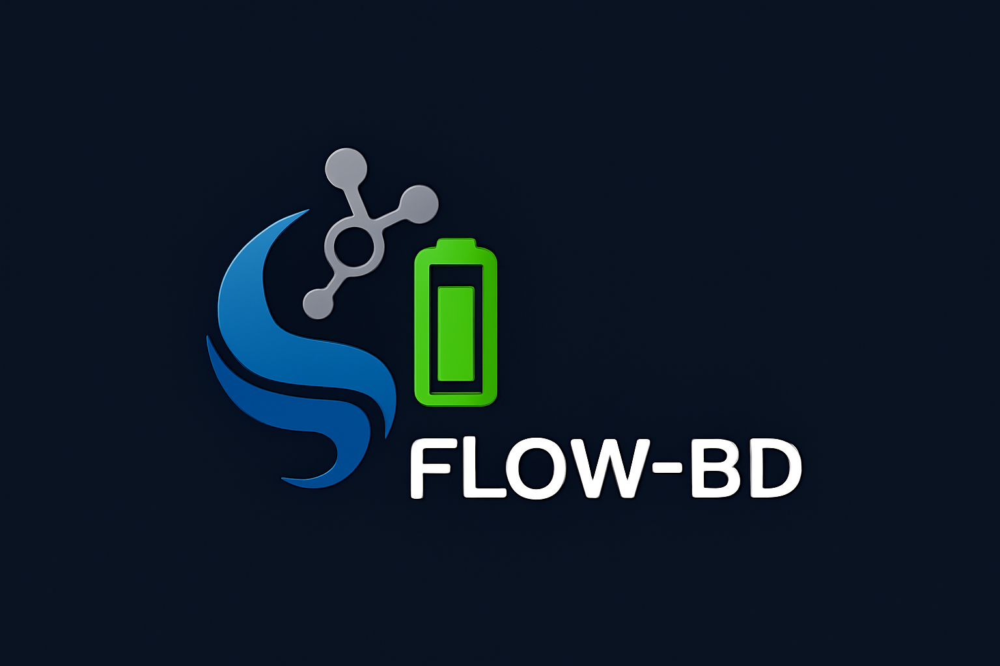

# FLOW-BD: Large Language Model for Iron-Chromium Flow Batteries

<p align="center">
  
</p>

---

## Overview
**FLOW-BD** is a specialized large language model (LLM) for the **iron-chromium redox flow battery (ICRFB)** domain.  
It is designed to accelerate **research, innovation, and engineering** in electrochemical energy storage.  

By integrating **materials science knowledge, chemical engineering expertise, and AI reasoning**, FLOW-BD supports researchers, engineers, and industry in advancing the next generation of flow battery technology.

---

## Key Features
- ⚡ **Domain Expertise:** Optimized for flow battery chemistry, particularly iron-chromium systems.  
- 🧪 **Scientific Reasoning:** Answers research questions, explains mechanisms, and analyzes technical literature.  
- 🔬 **Applied Insights:** Assists in electrolyte optimization, electrode design, and system integration.  
- 📚 **Data-Driven:** Built from curated datasets in electrochemistry, materials science, and renewable energy.  
- 🔧 **Extensible:** Easily fine-tuned with proprietary datasets for industry or academic applications.  

---

## Use Cases
- **Researchers** → Rapidly summarize literature, explore mechanisms, and generate hypotheses.  
- **Engineers** → Optimize electrolyte design, system performance, and cost-efficiency.  
- **Industry** → Guide scale-up decisions, production planning, and innovation strategies.  
- **Education** → Provide a learning platform for students and professionals studying flow batteries.  

---

## Installation

### Requirements
- Python 3.9+  
- CUDA-enabled GPU (recommended)  
- Virtual environment (optional but recommended)  

### Setup
```bash
# Clone repository
git clone https://github.com/your-org/FLOW-BD.git
cd FLOW-BD

# Create environment
python -m venv venv
source venv/bin/activate   # Linux/Mac
venv\Scripts\activate      # Windows

# Install dependencies
pip install -r requirements.txt
